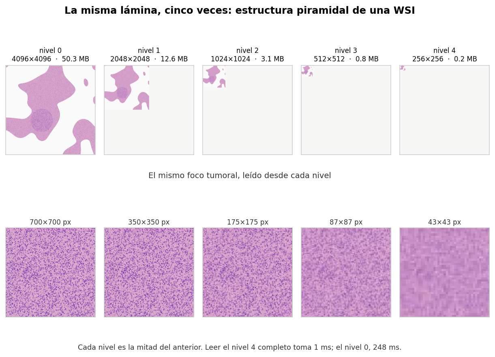
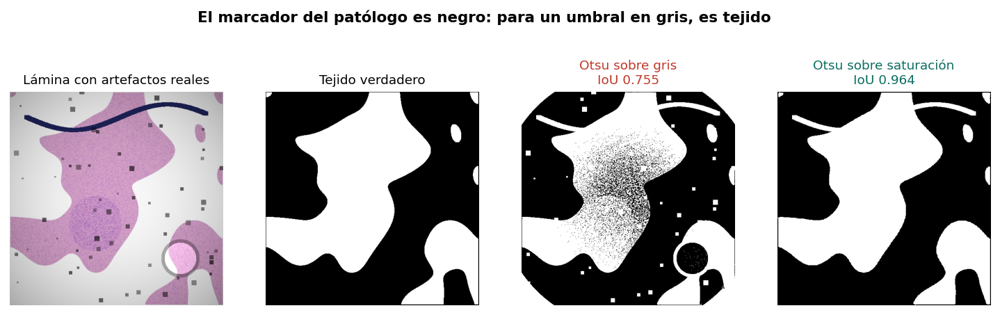
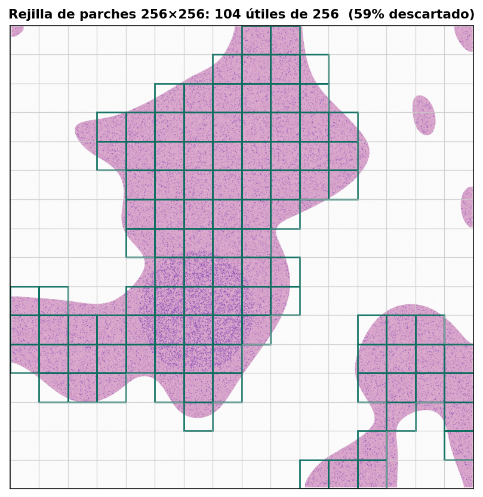

# Una imagen que no cabe en tu GPU

Construcción de una WSI sintética con estructura piramidal real, y resolución del primer
paso de cualquier pipeline de patología digital: decidir qué partes de la laminilla vale
la pena procesar.



## El problema

| Laminilla | Gigapíxeles | GB en RAM | Parches de 256 px |
|---|---|---|---|
| Biopsia pequeña a 20x | 0.9 | 2.7 | 13,689 |
| Laminilla típica a 40x | 10.0 | 30.0 | 152,399 |
| Resección grande a 40x | 30.0 | 90.0 | 457,197 |

Una GPU de consumo tiene entre 8 y 24 GB de VRAM. Y 152,000 parches por lámina son horas
de inferencia por laminilla.

## La pirámide

| Nivel | Dimensiones | Leer completo |
|---|---|---|
| 0 | 4096 × 4096 | 248 ms |
| 2 | 1024 × 1024 | 9 ms |
| 4 | 256 × 256 | 1 ms |

Estrategia: **localizar en un nivel alto, procesar en el nivel 0.**

La pirámide completa comprimida ocupa 2.9 MB contra los 50.3 MB que ocuparía solo el
nivel 0 en memoria. Los niveles extra añaden 33% de píxeles y la compresión los absorbe.

## Filtrado de fondo: el resultado principal

Comparación de los dos métodos habituales, con y sin los artefactos que tiene una lámina
real (marca de marcador, viñeteado del escáner, burbuja de aire, polvo):

| Método | Lámina limpia | Con artefactos |
|---|---|---|
| Otsu sobre gris | 0.996 | **0.755** |
| Otsu sobre saturación (HSV) | 0.993 | **0.964** |



Con lámina perfecta empatan. Con artefactos, el umbral en gris pierde 24 puntos de IoU.

**El marcador del patólogo es oscuro, y para un umbral en intensidad, oscuro significa
tejido.** La saturación mide cuánto color tiene el píxel, y el cristal sombreado sigue
siendo gris. Por eso la práctica estándar trabaja en HSV.

Limitación honesta: la saturación tampoco resuelve el marcador. La tinta azul es muy
saturada y se clasifica como tejido; quitarla requiere detección de color específico.

## Extracción de parches



De 256 parches en la rejilla, 104 tienen tejido: **59% descartado**. En laminillas reales
la proporción suele ser mayor.

El umbral del 50% de tejido por parche es una decisión, no una constante. Bajarlo incluye
parches de borde con poco tejido, que a veces es donde está la invasión tumoral.

## Contenido

```
notebooks/wsi_tiling.ipynb   Notebook completo, ejecutable sin datos externos
src/sintetica.py             Generador de WSI con histología H&E creíble
src/artefactos.py            Artefactos de laminilla escaneada
figuras/                     Figuras generadas
```

## Reproducir

```bash
git clone https://github.com/USUARIO/wsi-tiling.git
cd wsi-tiling
pip install -r requirements.txt
jupyter lab notebooks/wsi_tiling.ipynb
```

No requiere descargar datos: la laminilla se genera dentro del notebook. Tarda unos 40 s.

## Con laminillas reales

```bash
sudo apt install openslide-tools
pip install openslide-python
```

```python
import openslide
lamina = openslide.OpenSlide('tumor_001.tif')
lamina.level_dimensions
lamina.properties['openslide.mpp-x']          # micras por píxel

mini = np.array(lamina.get_thumbnail((1024, 1024)))
parche = np.array(lamina.read_region((x, y), 0, (256, 256)).convert('RGB'))
```

Bases públicas recomendadas:

| Base | Qué trae | Útil para |
|---|---|---|
| CAMELYON16/17 | Ganglio linfático con metástasis, anotaciones pixel a pixel | Detección y segmentación |
| PANDA | Biopsias de próstata con grado ISUP | Clasificación y gradación |
| TCGA | Miles de láminas de múltiples cánceres | Preentrenamiento, exploración |

Una sola lámina de CAMELYON pesa entre 1 y 3 GB. Descarga dos o tres para desarrollar.

## Limitaciones

El tejido es sintético: la histología real tiene glándulas, vasos, adipocitos y colágeno
orientado que este generador no modela.

No se trata la variación de tinción entre laboratorios (Macenko, Vahadane), que es el
principal problema de generalización en patología computacional.

No hay control de magnificación. Un parche de 256 px significa cosas distintas a 20x que a
40x; con datos reales hay que leer `mpp` y remuestrear a escala común, o el modelo aprende
la escala en vez de la biología.

El umbral de Otsu es global; en láminas con iluminación desigual conviene uno adaptativo.

## Referencias

- Goode A. et al. *OpenSlide: A vendor-neutral software foundation for digital pathology.* Journal of Pathology Informatics, 2013.
- Bejnordi B.E. et al. *Diagnostic Assessment of Deep Learning Algorithms for Detection of Lymph Node Metastases in Women With Breast Cancer.* JAMA, 2017.
- Otsu N. *A Threshold Selection Method from Gray-Level Histograms.* IEEE Trans. SMC, 1979.

## Licencia

MIT — ver [LICENSE](LICENSE).
